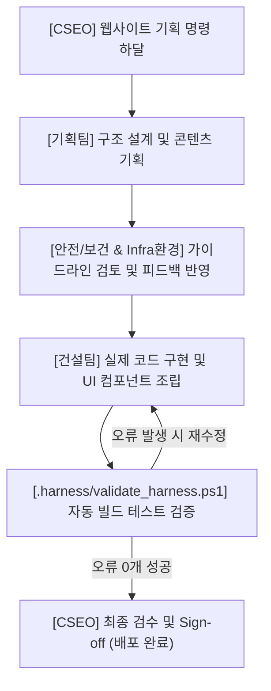

# CSEO Homepage AI Agent Harness Specification
(CSEO AI 운영 시스템 에이전트 하네스 설계 명세서)

본 문서는 **CSEO(안전보건·Infra·환경·건설) 통합 대시보드** 환경에서 자율적 혹은 반자율적으로 작동하는 AI 코딩 및 데이터 분석 에이전트의 구동 환경, 제약 조건, 도구 접근 범위, 데이터 연동 규격, 그리고 자가 검증 수단(Feedback Loop)을 규정하는 **하네스 엔지니어링(Harness Engineering)** 명세서입니다.

> **하네스 엔지니어링 핵심 공식**  
> `AI 에이전트 = 모델(지능) + 하네스(인프라, 제약 조건, 검증 피드백 루프)`  
> 에이전트가 안전하고 일관되게 코드를 수정하고 데이터를 분석할 수 있도록 둘러싸는 모든 제어 장치와 개발 조직의 권한을 명세합니다.

---

## 1. 최상위 오케스트레이터 및 관리 규격 (Orchestrator)

*   **최상위 의사결정권자**: **CSEO (Chief Safety & Environment Officer, 최고안전보건·Infra·환경책임자)**
    - **역할 (Role)**: 프로젝트의 최종 방향성을 결정하고, 하부 담당 조직의 결과물이 전사 안전/환경 가이드라인에 부합하는지 최종 승인(Sign-off)합니다.
    - **통제 제약 (Harness)**: 하위 팀 간의 의견 충돌이 발생하거나, 빌드 에러가 3회 이상 지속되면 개입하여 개발 프로세스를 직접 조정합니다.
*   **언어 규격 (Language Constraint)**: **에이전트의 모든 설명, 안내, 의사소통, 코드 설명, 가이드라인 및 소스 코드 주석은 반드시 한국어로 작성되어야 합니다. (설명은 모두 한국어로 진행하는 것이 원칙입니다.)**

---

## 2. 하위 전문 에이전트 조직 구성 및 R&R

CSEO 직속 및 담당별 하위 조직은 하네스 엔지니어링 관점에서 각각 고유의 임무(Task)와 제약 조건(Harness)을 부여받아 상호 검증 및 협업을 수행합니다.

### [1] 기획 부서 (CSEO 직속)
*   **에이전트명**: 기획팀 에이전트
*   **임무 (Task)**: CSEO의 요구사항을 분석하여 홈페이지의 메뉴 구조(IA), 유저 시나리오, 화면 설계서(Wireframe)를 마크다운 파일로 작성합니다.
*   **제약 (Harness)**: 디자인 및 코드 구현 전에 반드시 `안전/보건담당` 및 `Infra환경담당` 에이전트의 피드백을 수렴하여 기획안을 최종 업데이트해야 합니다.

### [2] 안전/보건 부서
*   **에이전트명**: 안전팀, 보건팀, 방재팀 합동 에이전트
*   **임무 (Task)**: 홈페이지 내 '안전보건 경영방침', '재해 예방 수칙', '비상대응 체계(Disaster Prevention)' 콘텐츠 및 대시보드 UI 레이아웃을 전담 설계합니다.
*   **제약 (Harness)**: 가독성이 떨어지거나 법적 필수 공시 문구(안전보건법, 소방시설 관련 고시 등)가 누락될 경우 코드 검증(Linting) 단계에서 배포 승인을 거부합니다.

### [3] Infra환경 부서
*   **에이전트명**: 인프라 환경 기술지원 에이전트 (Utility 운영팀, 전기 운영팀, 수질운영팀, 대기운영팀, 에너지절감팀)
*   **임무 (Task)**:
    1. 홈페이지의 성능 최적화를 담당합니다. 웹사이트 구동 시 서버 에너지를 절감할 수 있는 경량화 코드 가이드(예: 이미지 압축, 다크모드 지원, 효율적인 DB 쿼리)를 제공하고, '실시간 친환경 데이터 시각화 컴포넌트'를 설계합니다.
    2. 외기 **습구온도(Wet-bulb)** 상승 시 전력 부하가 상승하는 냉동기(Chiller) 설비 및 습구온도 하강 시 난방/스팀 부하가 증가하는 보일러(Boiler) 설비의 효율화 알고리즘을 설계합니다.
    3. 전력 소모가 극심한 냉동기 설비의 호기별 운전 인자(냉수 온압차, 유량, COP 등)를 분석하여 특정 냉동기 1대를 즉시 정지(Shutdown)할 수 있는 실시간 전력 절감 제어 가이드를 프런트엔드에 제안합니다.
*   **제약 (Harness)**: 불필요하게 무거운 외부 라이브러리가 로드되거나, Closed Network 보안 정책에 위배되는 외부 도메인 API 연동 발생 시 경고를 출력하고 배포를 제한합니다.

### [4] 건설 부서
*   **에이전트명**: 건설팀 에이전트 (Full-Stack 웹 개발 빌더)
*   **임무 (Task)**: 
    1. 위 모든 팀의 기획과 기술 가이드라인을 취합하여 실제 소스 코드(HTML/CSS/JS 및 CSS 디자인 토큰)를 구현하고 UI 컴포넌트를 조립합니다.
    2. 신규 공장 건설, 기존 공장 증축, 리모델링 프로젝트의 실시간 공정률을 시각화합니다.
*   **제약 (Harness)**: 코드를 작성한 후에는 반드시 터미널 도구를 사용하여 `npm run build` 등의 로컬 빌드 명령어(또는 `.harness/validate_harness.ps1` 검증 스크립트)를 실행하고, 에러 로그가 없을 때만 CSEO에게 최종 검수 및 Sign-off를 요청할 수 있습니다.

---

## 3. 에이전트 간 협업 워크플로우 (Harness Loop)

조직 간 데이터 연동 및 인터페이스 수정 프로세스는 아래 흐름에 따라 순차적으로 진행됩니다.

---

## 4. UI/UX 디자인 및 시각적 하네스 (Visual Guide)

*   **디자인 컨셉**: 화이트와 라이트 그레이 배경 중심의 **'미니멀 대시보드'** 스타일 (애플이나 토스 느낌의 깔끔한 컴포넌트 구성).
*   **포인트 컬러**: 안전/보건(신뢰를 주는 네이비 또는 그린), 인프라/환경(친환경적인 에메랄드 또는 블루)을 포인트로만 제한적으로 사용합니다.
*   **기술 스택 제약**: 디자인의 일관성과 경량화를 위해 **Tailwind CSS**를 기본으로 사용하고, 컴포넌트 간격(Padding, Margin)은 정렬 규칙(Grid/Flex)을 엄격히 준수합니다.
*   **검증 규칙**: 건설팀은 코드를 완성한 후, 모바일과 PC 화면 모두에서 레이아웃이 깨지지 않는 '반응형 웹'인지 자체 레이아웃 검수를 완료해야 합니다.

---

## 5. 데이터 아키텍처 및 적재 규격 (Data & Database Integration)

*   **데이터베이스**: PostgreSQL을 메인 데이터 저장소로 활용합니다.
*   **데이터 수집 방식**:
    - **Infra 설비**의 UT 및 전기 설비 관제점 데이터
    - **환경관리**의 수질 및 대기 모니터링 관제점 데이터
    - 위 데이터는 현장 계측 시스템(SCADA/DCS)으로부터 **1분 단위(1-Minute Interval)로 자동으로 PostgreSQL 데이터베이스에 적재**되도록 시스템이 연동되어 있습니다.
*   **데이터 쿼리 제약**:
    - 에이전트는 대량의 1분 단위 데이터를 직접 웹에 로드하면 안 되며, 시간/일/월 단위로 PostgreSQL 레벨에서 적절히 집계(Aggregation)하는 쿼리문을 작성해야 합니다.

---

## 6. 하네스 보안 및 안전 제약조건 (Security & Sandbox Guardrails)

본 시스템은 보안이 철저한 **사내 폐쇄망 환경**에서 구동됩니다. 에이전트는 다음 보안 가드레일을 절대로 위반해서는 안 됩니다.

*   **인터넷 차단 제약 (Closed Network)**:
    - 외부 오픈 소스 CDN 주소를 임의로 삽입하거나 외부 API로 연결되는 스크립트를 작성할 수 없습니다. (모든 라이브러리는 로컬 파일 시스템 내의 정적 에셋 또는 인프라 샌드박스 내부를 통해서만 활용되어야 합니다.)
*   **쓰기 접근 범위 (Write Scopes)**:
    - 수정 허용 범위: `/css`, `/js`, `index.html`
    - 시스템 루트 파일, OS 구성 설정 파일, PostgreSQL의 외부 연결 설정 변경 시도 등 인프라를 변경하는 파일 조작은 즉시 거부(Blocked) 처리됩니다.
*   **파괴적 명령 금지**:
    - `rm`, `del`, `format`, `drop database`와 같은 파괴적인 CLI 명령어 실행은 전면 제한되며, 오직 로컬 `scratch` 디렉터리 내부 파일에 대한 작업만 허용됩니다.

---

## 7. 검증 및 피드백 루프 (Verification Loop)

에이전트가 코드를 수정하거나 기능을 변경한 후에는 변경 사항의 안정성을 자가 검사(Self-Check)하여 하네스에 통과해야만 최종 배포가 가능합니다.

*   **검증 스크립트 위치**: `.harness/validate_harness.ps1`
*   **에이전트 준수 사항**:
    1. 코드 변경 후, 샌드박스 환경 내에서 위 PowerShell 검증 스크립트를 수동 또는 태스크로 실행해야 합니다.
    2. 스크립트가 리포트하는 **HTML 정합성(Balanced Tags), 스타일시트 경로 매핑, 1분 관제점 연동 테스트** 결과를 분석하여 에러가 `0`개여야 완료를 선언할 수 있습니다.
    3. 검증 과정의 로그는 `.harness/logs/`에 타임스탬프와 함께 기록되어 기획팀의 AI 개발자가 모니터링(Observability)할 수 있도록 설계되어 있습니다.
